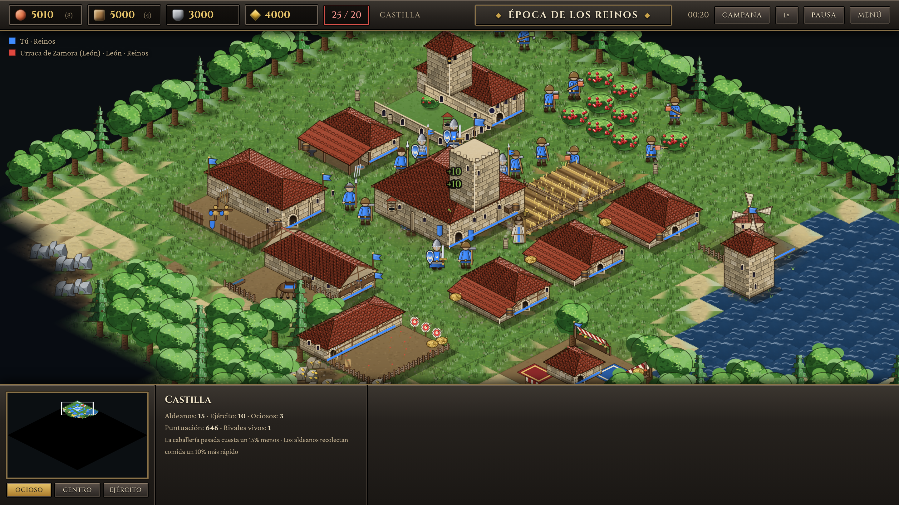
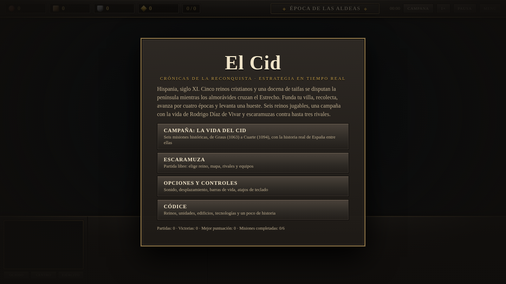
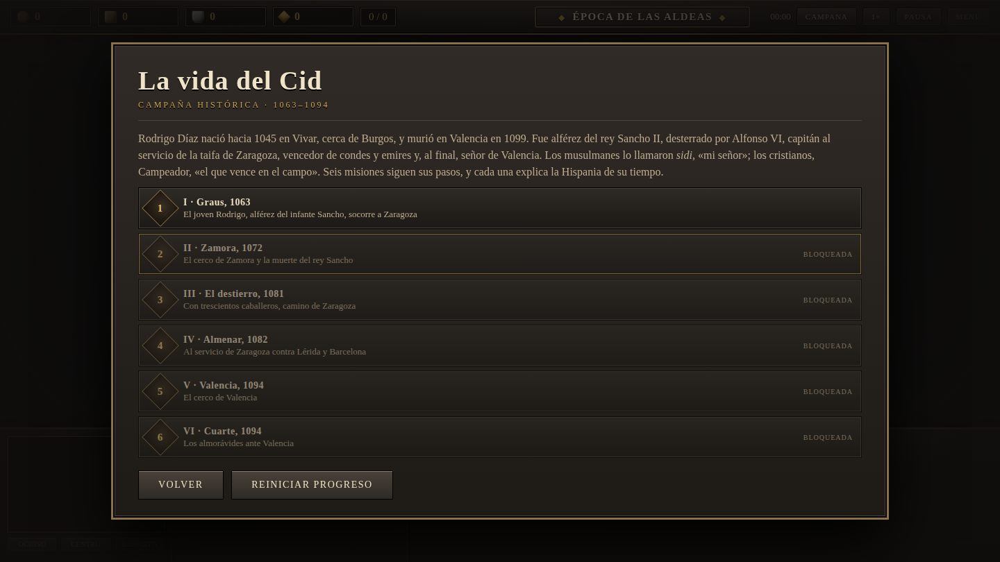

<h1 align="center">⚔️ El Cid — Crónicas de la Reconquista</h1>

<p align="center">
  <b>Estrategia en tiempo real isométrica en la Hispania del siglo XI.</b><br>
  Funda tu villa, recolecta, avanza por cuatro épocas y levanta una hueste.<br>
  Sin instalación, sin cuentas, sin dependencias: se juega en el navegador.
</p>

<p align="center">
  <a href="https://alvarodiez20.github.io/campeador/"><b>▶️ JUGAR AHORA</b></a>
</p>

<p align="center">
  <a href="https://alvarodiez20.github.io/campeador/">
    
  </a>
</p>

---

## 🏰 Qué es esto

Un RTS completo al estilo *Age of Empires*, escrito en **HTML + CSS + JavaScript puro**.
Cero dependencias, cero build, cero assets: **todo el arte —terreno pintado, 19 edificios en seis estilos arquitectónicos, 32 unidades e iconos grabados— se genera por código** al cargar la página, y la música y los efectos se sintetizan con WebAudio.

| | |
|---|---|
| 🛡️ **6 reinos jugables** | Castilla, León, Aragón y Navarra, Taifa de Zaragoza, Taifa de Sevilla y Almorávides, cada uno con bonificaciones, unidad única y **arquitectura propia**: sillería y teja roja en Castilla, granito y pizarra en León, arenisca y tablilla en Aragón, ladrillo y teja vidriada verde en Zaragoza, cal y azulejo en Sevilla, adobe y merlones escalonados entre los almorávides |
| 📜 **Campaña histórica** | Seis misiones sobre la vida de Rodrigo Díaz: Graus (1063), Zamora (1072), el Destierro (1081), Almenar (1082), Valencia (1094) y Cuarte (1094) |
| ⚔️ **Escaramuza** | Contra 1–3 rivales o en 2 contra 2, cuatro dificultades, cinco mapas, tres tipos de inicio |
| 🌾 **Economía** | Cuatro recursos, cuatro épocas, 17 edificios, 20 unidades con líneas de mejora y 30 tecnologías |
| 🧠 **IA con carácter** | Rivales económicos, agresivos, defensivos o equilibrados |
| ✝️ **Detalles de casa** | Guarnición, campana del pueblo, clérigos que curan, convierten y portan reliquias, mercado, catedral, posturas, patrulla, vigilancia y puertas |

## 🎮 Cómo se juega

| Tecla | Acción |
|---|---|
| **Clic izq.** | Seleccionar · arrastrar para selección múltiple · doble clic selecciona todos los del mismo tipo |
| **Clic der.** | Mover, recolectar, construir, atacar, reparar, guarnecer, curar o convertir, según el objetivo |
| **Shift** | Añadir a la selección · encolar órdenes · entrenar de 5 en 5 · colocar varios edificios |
| **A · S · Supr** | Atacar-mover · detener · eliminar unidad |
| **Z · X** | Patrullar · vigilar (seguir y proteger) |
| **G · V** | Guarnecer · desalojar |
| **Q · W · E** | Postura agresiva · defensiva · no moverse |
| **H · . · Ctrl+A** | Centro urbano · aldeano ocioso · seleccionar todo el ejército |
| **Ctrl+1..9 / 1..9** | Crear / seleccionar grupo de control (dos veces: centrar) |
| **Ctrl+B · Espacio** | Campana del pueblo · ir al último aviso |
| **P · F · M · F1 · Esc** | Pausa · velocidad · silencio · ayuda · menú |

La partida guardada, el progreso de campaña y las opciones viven en el `localStorage` de tu navegador.

## 🖼️ Galería

<p align="center">
  
  
</p>

## 🧪 El motor nuevo (`engine/`)

Junto a este juego vive un **segundo proyecto**: el vertical slice de un motor
RTS construido con otro planteamiento técnico —PixiJS v8, TypeScript estricto,
ECS propio, simulación determinista en punto fijo y pathfinding en Web Worker—
con la defensa de Valencia de 1094 como escenario jugable y las **parias**
(los tributos que los reinos cristianos cobraban a las taifas) como eje
económico y diplomático.

| | |
|---|---|
| ▶️ **Jugar** | <https://alvarodiez20.github.io/campeador/motor/> |
| 🧱 **Banco de pruebas** | <https://alvarodiez20.github.io/campeador/motor/?modo=banco&n=500> |
| 📖 **Documentación** | [`engine/README.md`](engine/README.md) · [`docs/`](docs/) |

```bash
cd engine && npm install && npm run dev
```

Los dos proyectos conviven a propósito: el de la raíz es un juego terminado
sin dependencias; el de `engine/` es la base sobre la que crecer, con la
simulación separada del render y un criterio de rendimiento que se mide antes
de producir arte. Las decisiones que lo sostienen están en
[`docs/DECISIONES.md`](docs/DECISIONES.md) y lo que se ha dejado a medias, con
su motivo, en [`docs/DEUDA.md`](docs/DEUDA.md).

---

## 🧭 Estructura del proyecto

```
index.html        página y marcado de la interfaz
css/style.css     interfaz (paneles de madera y piedra, menús)
js/cid-art.js     núcleo del arte pintado: terreno, naturaleza, iconos, estilos por reino
js/cid-art-buildings.js  los 19 edificios en los seis estilos arquitectónicos
js/cid-art-units.js      las 32 unidades, de frente y de perfil
js/data.js        reinos, unidades, edificios, tecnologías, épocas
js/map.js         generación de mapas (5 tipos), A* y niebla de guerra
js/entities.js    jugadores, órdenes, combate, guarnición, mercado, catedral, clérigos
js/ai.js          IA con personalidades
js/sprites.js     puente con el arte: caché, obras en curso, mezcla de bordes del terreno
js/render.js      render isométrico 2:1 por trozos, orden de profundidad, minimapa
js/ui.js          selección, órdenes, panel de mandos, atajos, HUD
js/audio.js       efectos y música sintetizados con WebAudio
js/campaign.js    las seis misiones, con objetivos, guion e historia
js/main.js        bucle principal, menús, guardado/carga, estadísticas

engine/           motor nuevo: PixiJS v8 + TypeScript + ECS + Vite
  src/core        punto fijo, RNG determinista, bucle de tick fijo
  src/ecs         entidades y columnas de TypedArray
  src/sim         simulación: movimiento, combate, economía, parias
  src/path        campos de flujo y A* jerárquico, en Web Worker
  src/render      render isométrico, atlas, niebla de guerra
  src/game        facciones, datos, escenario de Cuarte 1094, IA
  test            68 pruebas, todas en Node
  tools/blender   horneado de sprites isométricos desde Blender
docs/             decisiones, deuda técnica, balance, fuentes, tratamiento
```

## 💻 Ejecutarlo en local

```bash
git clone https://github.com/alvarodiez20/campeador.git
cd campeador
python3 -m http.server 8000
# abre http://localhost:8000
```

Basta con un servidor estático cualquiera; no hay nada que compilar.

## 🚀 Despliegue

Cada `push` publica el sitio automáticamente mediante GitHub Actions
([`.github/workflows/pages.yml`](.github/workflows/pages.yml)) en
👉 **<https://alvarodiez20.github.io/campeador/>**

---

<p align="center">
  <i>«El que en buen hora ciñó espada.»</i><br>
  <sub>Cantar de mio Cid</sub>
</p>
